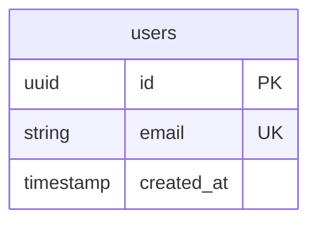

# Método AInnovate — Framework de Producción con IA

> **Versión:** 2.1
> **Autor:** AInnovate Academy
> **Para:** Cualquier proyecto (web app, desktop app, mobile, landing, SaaS, etc.)
> **Compatible con:** Windsurf (Cascade), Claude Code, Cursor, ChatGPT, Copilot, o cualquier IA de desarrollo
> **Fecha de Creación:** {{FECHA_CREACION}}

---

## Cómo Usar Este Documento

### Paso a Paso

1. **Copia este archivo** a la raíz de tu nuevo proyecto como `METODO_AINNOVATE.md`
2. **Abre tu IDE con IA** (Windsurf, Cursor, Claude Code, etc.)
3. **Pega este prompt** en el chat de la IA:

```
Lee el archivo METODO_AINNOVATE.md completo y sigue las instrucciones de la FASE 1.
Mi proyecto es: [describe tu proyecto en 2-3 oraciones].
Stack que quiero usar: [ej: Next.js + Supabase + TailwindCSS].
```

4. La IA va a crear automáticamente:
   - Toda la estructura de carpetas del proyecto
   - Los archivos de reglas para IA (`.windsurfrules`, `CLAUDE.md`)
   - La carpeta `docs/` con todos los documentos base
   - `CHANGELOG.md`, `DB_SCHEMA.md`, `API_DOCS.md`
   - El archivo de dependencias (`package.json`, `requirements.txt`, etc.)
   - El archivo `.env.example`

5. **Para cada nueva funcionalidad**, dile a la IA:

```
Voy a agregar la funcionalidad de [X].
```

6. La IA automáticamente va a:
   - Crear el documento de la feature ANTES de codear
   - Escribir el código siguiendo la doc
   - Actualizar TODOS los docs afectados al terminar
   - Registrar el cambio en el CHANGELOG

### Cómo Dar Instrucciones a la IA (Formato Recomendado)

```
## Contexto
[Explicación del contexto — qué estás haciendo y por qué]

## Request
[Lo que necesitas exactamente]

## Notas adicionales (opcional)
[Cualquier consideración especial]
```

---

## ¿Qué es el Método AInnovate?

Es un framework de **Documentation-Driven Development (DDD)** optimizado para trabajar con IAs de código. Se basa en dos principios:

> **1. La IA primero lee, luego codea, y al final documenta.**
> **2. Si la IA no sabe cómo funciona tu proyecto, va a romper tu proyecto.**

Esto resuelve los problemas más comunes al trabajar con IA:

| Problema | Solución AInnovate |
|----------|-------------------|
| La IA "olvida" cómo funciona tu proyecto | Documentos siempre actualizados que la IA lee antes de actuar |
| La IA rompe cosas que ya funcionan | 12 Mandamientos inmutables + archivos protegidos |
| La IA alucina y agrega cosas no pedidas | Mandamiento I: NO ALUCINARÁS |
| El proyecto se vuelve inmantenible | Estructura escalable + docs obligatorios desde el día 1 |
| No hay trazabilidad de cambios | CHANGELOG obligatorio en cada request |
| La IA mezcla lógica y estilos | Separación estricta de responsabilidades |

---

# LOS 12 MANDAMIENTOS DEL VIBE CODING

Estos mandamientos son **INVIOLABLES**. La IA DEBE seguirlos en TODO momento.

---

## MANDAMIENTO I: NO ALUCINARÁS

```
LA IA SOLO IMPLEMENTARÁ EXACTAMENTE LO QUE SE LE PIDE.
NADA MÁS. NADA MENOS.
```

**Reglas:**
- NO agregar funcionalidades "porque podrían ser útiles"
- NO remover código existente sin autorización explícita
- NO cambiar nombres de variables, funciones o archivos sin solicitud
- NO optimizar código que no se pidió optimizar
- NO agregar dependencias no solicitadas
- SI hay ambigüedad → PREGUNTAR antes de implementar
- SI se detecta un bug → REPORTAR pero NO corregir sin autorización

**Ante ambigüedad, la IA debe responder:**
```
CLARIFICACIÓN REQUERIDA:
[Descripción de la ambigüedad]

Opciones:
A) [Opción 1]
B) [Opción 2]

Por favor, indica cómo proceder.
```

---

## MANDAMIENTO II: SEPARARÁS LÓGICA DE ESTILOS

```
LA LÓGICA DE NEGOCIO Y LOS ESTILOS NUNCA CONVIVIRÁN EN EL MISMO ARCHIVO.
```

**Estructura obligatoria por componente:**
```
components/
└── Button/
    ├── Button.tsx          # Solo lógica y JSX
    ├── Button.module.css   # Solo estilos del componente (o .css si usa Tailwind)
    ├── Button.types.ts     # Solo tipos/interfaces
    └── index.ts            # Exportación
```

**Prohibiciones:**
- NO usar estilos inline (`style={{}}`) excepto para valores dinámicos calculados
- NO importar CSS globales en componentes
- NO usar CSS-in-JS (styled-components, emotion) sin autorización explícita

> **Nota:** Si el proyecto usa TailwindCSS, las clases van en el JSX pero la lógica de negocio sigue separada en archivos dedicados. Si el proyecto usa CSS Modules, la separación es por archivo.

---

## MANDAMIENTO III: DOCUMENTARÁS CADA CAMBIO

```
NINGÚN CAMBIO EXISTIRÁ SIN SU CORRESPONDIENTE DOCUMENTACIÓN.
```

**Documentos OBLIGATORIOS del proyecto:**

| # | Archivo | Contenido | Creado en |
|---|---------|-----------|-----------|
| 1 | `docs/01-project-overview.md` | Visión, objetivos, stack, estado | FASE 1 |
| 2 | `docs/02-architecture.md` | Estructura técnica, carpetas, decisiones | FASE 1 |
| 3 | `docs/03-security.md` | Seguridad, credenciales, RLS, validaciones | FASE 1 |
| 4 | `docs/04-deployment.md` | Proceso de deploy, checklist | Cuando aplique |
| 5 | `docs/DB_SCHEMA.md` | Esquema completo de base de datos | FASE 1 |
| 6 | `docs/API_DOCS.md` | Documentación de todos los endpoints | FASE 1 |
| 7 | `docs/features/*.md` | Un doc por cada funcionalidad | FASE 2 |
| 8 | `CHANGELOG.md` | Historial de TODOS los cambios | FASE 1 |
| 9 | `.windsurfrules` | Reglas para Windsurf/Cascade | FASE 1 |
| 10 | `CLAUDE.md` | Reglas para Claude Code | FASE 1 |
| 11 | `docs/SKILLS.md` | Registro de skills/extensiones instaladas | FASE 1 |

---

## MANDAMIENTO IV: ACTUALIZARÁS EL CHANGELOG

```
CADA REQUEST QUE MODIFIQUE CÓDIGO ACTUALIZARÁ EL CHANGELOG.
```

**Formato obligatorio:**
```markdown
## [YYYY-MM-DD HH:MM] - Descripción breve

### Tipo de cambio
- **ADDED**: Nuevas funcionalidades
- **CHANGED**: Cambios en funcionalidades existentes
- **FIXED**: Corrección de bugs
- **REMOVED**: Funcionalidades eliminadas
- **SECURITY**: Cambios de seguridad

### Archivos afectados
- `ruta/archivo1.tsx` - [Descripción del cambio]
- `ruta/archivo2.css` - [Descripción del cambio]

### Descripción detallada
[Explicación completa del cambio realizado]

### Request original
> [Copia textual del request del usuario]
```

---

## MANDAMIENTO V: DOCUMENTARÁS LA BASE DE DATOS

```
CADA CAMBIO EN EL ESQUEMA DE DB SERÁ DOCUMENTADO INMEDIATAMENTE EN DB_SCHEMA.md
```

El archivo `docs/DB_SCHEMA.md` debe contener:
- Diagrama ER (Mermaid)
- Descripción de cada tabla con TODOS sus campos
- Relaciones entre tablas (FK)
- Políticas RLS activas (con SQL)
- Índices y constraints
- Triggers y funciones
- Historial de migraciones
- Tipos TypeScript generados

> **Template completo de DB_SCHEMA.md:** Ver [Apéndice A](#apéndice-a--template-db_schemamd)

---

## MANDAMIENTO VI: SEGUIRÁS LA ESTRUCTURA DE CARPETAS

```
LA ESTRUCTURA DEL PROYECTO ES SAGRADA E INMUTABLE SIN AUTORIZACIÓN.
```

La IA debe seguir la estructura de carpetas definida en `docs/02-architecture.md`. Si necesita crear archivos fuera de la estructura documentada → PREGUNTAR primero.

**Estructura base recomendada (adaptar al stack):**

```
proyecto/
├── docs/                           # Documentación (Método AInnovate)
│   ├── 01-project-overview.md
│   ├── 02-architecture.md
│   ├── 03-security.md
│   ├── 04-deployment.md
│   ├── DB_SCHEMA.md
│   ├── API_DOCS.md
│   └── features/                   # Un .md por funcionalidad
├── src/                            # Código fuente
│   ├── app/                        # Rutas / páginas
│   ├── components/                 # Componentes reutilizables
│   │   ├── ui/                     # Componentes base (Button, Input, Card...)
│   │   ├── layout/                 # Header, Footer, Sidebar, Container
│   │   └── features/               # Componentes por feature
│   ├── styles/                     # Sistema de estilos
│   │   ├── variables.css           # Variables CSS (colores, spacing, etc.)
│   │   ├── reset.css               # Reset/Normalize
│   │   ├── typography.css          # Sistema tipográfico
│   │   ├── main.css                # Clases globales reutilizables
│   │   ├── utilities.css           # Clases utilitarias
│   │   └── animations.css          # Animaciones globales
│   ├── lib/                        # Utilidades, configs, clientes
│   ├── hooks/                      # Custom hooks
│   ├── types/                      # Tipos globales
│   ├── constants/                  # Constantes
│   └── services/                   # Servicios y API calls
├── public/                         # Assets estáticos
├── supabase/                       # Supabase config + migrations
│   ├── migrations/
│   └── config.toml
├── .windsurfrules                  # Reglas para IA (Windsurf)
├── CLAUDE.md                       # Reglas para IA (Claude)
├── CHANGELOG.md                    # Historial de cambios
├── .env.local                      # Variables de entorno (NO COMMIT)
├── .env.example                    # Template de variables
└── package.json
```

> **Nota:** Esta estructura es para Next.js + Supabase. Adaptar según el stack (Electron, Python, Vue, etc.). Lo importante es que SIEMPRE exista `docs/` y los archivos de reglas.

---

## MANDAMIENTO VII: USARÁS EL SISTEMA DE ESTILOS DEFINIDO

```
TODO ESTILO SEGUIRÁ LA JERARQUÍA ESTABLECIDA EN EL PROYECTO.
```

**Jerarquía (de mayor a menor especificidad):**

1. **`variables.css`** — Variables CSS globales (colores, spacing, typography, shadows, transitions)
2. **`reset.css`** — Reset/Normalize base
3. **`typography.css`** — Sistema tipográfico
4. **`main.css`** — Clases globales reutilizables (.container, .card, .btn, .form-input, .badge)
5. **`ComponentName.module.css`** — Estilos específicos del componente

La IA debe documentar las variables CSS disponibles en `02-architecture.md` para que futuros prompts las usen en vez de inventar valores nuevos.

> **Si el proyecto usa TailwindCSS:** La jerarquía se simplifica a `tailwind.config` + clases de utilidad en JSX. La IA debe respetar el design system configurado en `tailwind.config` y NO inventar colores/tamaños fuera del sistema.

---

## MANDAMIENTO VIII: PROTEGERÁS LAS CREDENCIALES

```
NINGUNA CREDENCIAL O SECRETO APARECERÁ EN EL CÓDIGO.
```

**Reglas:**
- Usar variables de entorno para TODAS las credenciales
- NUNCA commitear `.env.local` o `.env`
- NUNCA hardcodear URLs de APIs, claves, o tokens
- NUNCA exponer claves de servicio (service role) en el cliente
- SIEMPRE crear `.env.example` con las variables necesarias (sin valores reales)
- SIEMPRE validar existencia de variables al iniciar la app

**Prefijos por framework:**
| Framework | Variable pública | Variable privada |
|-----------|-----------------|-----------------|
| Next.js | `NEXT_PUBLIC_*` | Sin prefijo |
| Vite/React | `VITE_*` | Sin prefijo (solo server) |
| Electron | Via preload (IPC) | Main process |

---

## MANDAMIENTO IX: TIPARÁS TODO CON TYPESCRIPT

```
NINGUNA VARIABLE, FUNCIÓN O COMPONENTE EXISTIRÁ SIN TIPOS.
```

**Reglas:**
- NO usar `any` jamás (usar `unknown` si es necesario)
- NO usar `// @ts-ignore` sin explicación documentada
- Todos los props de componentes → tipados
- Todos los retornos de funciones → tipados
- Usar tipos generados de la DB cuando existan (Supabase gen types)
- Interfaces de props en archivos `.types.ts` separados

> **Si el proyecto NO usa TypeScript:** Usar JSDoc para documentar tipos en los comentarios.

---

## MANDAMIENTO X: VALIDARÁS ANTES DE ENTREGAR

```
NINGÚN CÓDIGO SE CONSIDERARÁ COMPLETO SIN VALIDACIÓN.
```

**Checklist que la IA debe verificar al terminar cada implementación:**
- [ ] El código compila sin errores
- [ ] Los estilos se aplican correctamente
- [ ] La funcionalidad hace exactamente lo pedido (nada más, nada menos)
- [ ] La documentación está actualizada
- [ ] El CHANGELOG tiene la nueva entrada
- [ ] No se introdujeron dependencias no solicitadas
- [ ] No hay credenciales hardcodeadas
- [ ] Los tipos están completos

---

## MANDAMIENTO XI: MANTENDRÁS LA CONSISTENCIA

```
CADA ARCHIVO SEGUIRÁ LAS CONVENCIONES ESTABLECIDAS DEL PROYECTO.
```

**Convenciones de nomenclatura recomendadas:**

| Tipo | Convención | Ejemplo |
|------|------------|---------|
| Componentes | PascalCase | `UserCard.tsx` |
| Hooks | camelCase con "use" | `useAuth.ts` |
| Utilidades | camelCase | `formatDate.ts` |
| Constantes | SCREAMING_SNAKE | `API_ENDPOINTS.ts` |
| Tipos/Interfaces | PascalCase | `UserTypes.ts` |
| CSS Modules | camelCase | `.userCard` |
| Variables CSS | kebab-case | `--color-primary` |
| Archivos CSS | PascalCase.module | `UserCard.module.css` |
| Servicios | camelCase + .service | `user.service.ts` |

> **Regla de oro:** La IA debe leer los archivos existentes y seguir la convención que YA usa el proyecto. Si el proyecto usa `snake_case`, no cambiar a `camelCase`.

---

## MANDAMIENTO XII: COMUNICARÁS CON CLARIDAD

```
CADA RESPUESTA DE LA IA INCLUIRÁ RESUMEN DE ACCIONES REALIZADAS.
```

**Formato de respuesta obligatorio post-implementación:**

```markdown
## IMPLEMENTACIÓN COMPLETADA

### Resumen
[Descripción breve de lo implementado]

### Archivos creados/modificados
- `ruta/archivo.tsx` - [Descripción]

### Cambios en base de datos
- [Si aplica, describir cambios]

### Documentación actualizada
- [x] CHANGELOG.md
- [x] docs/features/[feature].md
- [ ] DB_SCHEMA.md (no aplica)
- [ ] API_DOCS.md (no aplica)

### Notas importantes
- [Cualquier consideración relevante]
```

---

# FASE 1 — Setup Inicial (La IA ejecuta esto al inicio del proyecto)

Al recibir el prompt inicial, la IA debe ejecutar estos pasos EN ORDEN:

## 1.1 Crear Estructura de Documentación

Crear la carpeta `docs/` con todos los archivos base:

```
docs/
├── 01-project-overview.md
├── 02-architecture.md
├── 03-security.md
├── 04-deployment.md       ← (puede estar vacío, se llena cuando aplique)
├── DB_SCHEMA.md            ← (template base, se llena con cada tabla)
├── API_DOCS.md             ← (template base, se llena con cada endpoint)
├── SKILLS.md               ← (registro de skills/extensiones instaladas)
└── features/               ← (vacío, se llena en FASE 2)
```

## 1.2 Crear `docs/01-project-overview.md`

```markdown
# [Nombre del Proyecto]

## Visión
[Qué es el proyecto y para quién — 2-3 oraciones]

## Objetivos
- [Objetivo 1]
- [Objetivo 2]
- [Objetivo 3]

## Stack Técnico
| Capa | Tecnología | Versión |
|------|-----------|---------|
| Frontend | [React/Vue/Svelte] | [x.x] |
| Framework | [Next.js/Nuxt/SvelteKit] | [x.x] |
| Backend | [API Routes/Express/etc] | - |
| Base de datos | [Supabase/Firebase/etc] | - |
| Estilos | [TailwindCSS/CSS Modules] | - |
| Auth | [Supabase Auth/NextAuth/etc] | - |
| Deploy | [Vercel/Netlify/etc] | - |

## Estado del Proyecto
| Fase | Descripción | Estado |
|------|-------------|--------|
| 1 | Setup + Auth | [ ] Pendiente |
| 2 | [Feature core] | [ ] Pendiente |
| 3 | [Feature secundaria] | [ ] Pendiente |
| 4 | Polish + Deploy | [ ] Pendiente |

## Principio Fundamental
> [La regla #1 del proyecto]
```

## 1.3 Crear `docs/02-architecture.md`

```markdown
# Arquitectura — [Nombre del Proyecto]

## Stack Completo
[Lista de todas las dependencias con versiones]

## Estructura de Carpetas
[Árbol completo de carpetas con descripciones]

## Base de Datos
[Resumen de tablas — detalle completo en DB_SCHEMA.md]

## Flujo de Datos
[Cómo se comunican los componentes entre sí]

## Variables de Entorno
| Variable | Descripción | Tipo | Requerida |
|----------|-------------|------|-----------|
| `NEXT_PUBLIC_SUPABASE_URL` | URL de Supabase | pública | SI |
| ... | ... | ... | ... |

## Convenciones del Proyecto
[Nomenclatura, patrones, estilo de código que se usa]

## Decisiones Arquitectónicas
### ADR-001: [Decisión]
**Fecha:** YYYY-MM-DD
**Contexto:** [Por qué]
**Decisión:** [Qué se decidió]
**Consecuencias:** [Impacto]
```

## 1.4 Crear `docs/03-security.md`

```markdown
# Seguridad — [Nombre del Proyecto]

## Autenticación
[Método de auth usado, flujo, tokens]

## Autorización
[Roles, permisos, RLS]

## Variables de Entorno
[Qué variables son secretas y cómo se protegen]

## Reglas INVIOLABLES
- NUNCA hardcodear credenciales
- NUNCA exponer service role key en el cliente
- NUNCA desactivar RLS sin autorización
- NUNCA hacer deploy sin checklist de seguridad
- SIEMPRE validar input en servidor (no confiar en cliente)
- SIEMPRE usar tipos para prevenir inyección
```

## 1.5 Crear `docs/DB_SCHEMA.md` (Template)

La IA debe crear este archivo con el template base. Se va llenando conforme se crean tablas.

> **Ver template completo:** [Apéndice A](#apéndice-a--template-db_schemamd)

## 1.6 Crear `docs/API_DOCS.md` (Template)

La IA debe crear este archivo con el template base. Se va llenando conforme se crean endpoints.

> **Ver template completo:** [Apéndice B](#apéndice-b--template-api_docsmd)

## 1.7 Crear Reglas para TODOS los IDEs con IA

La IA DEBE crear **automáticamente** archivos de reglas para todos los IDEs populares. Cada IDE lee su archivo de reglas de forma automática al abrir el proyecto — esto es lo que hace que la IA "sepa" cómo trabajar sin que el usuario tenga que repetir instrucciones.

### Archivos que se crean (TODOS con el mismo contenido base):

| # | Archivo | IDE/IA que lo lee | Lectura |
|---|---------|-------------------|---------|
| 1 | `.windsurfrules` | Windsurf (Cascade) | Automática |
| 2 | `CLAUDE.md` | Claude Code (Anthropic) | Automática |
| 3 | `.cursorrules` | Cursor | Automática |
| 4 | `.github/copilot-instructions.md` | GitHub Copilot | Automática |
| 5 | `.clinerules` | Cline / Continue | Automática |
| 6 | `.aider.conf.yml` | Aider | Automática (formato YAML) |

> **La IA debe crear TODOS estos archivos** con el mismo contenido base adaptado al formato de cada uno. Así el proyecto funciona sin importar qué IDE use el desarrollador.

### Contenido Base de las Reglas (usar en todos los archivos)

El contenido es idéntico para `.windsurfrules`, `CLAUDE.md`, `.cursorrules`, `.github/copilot-instructions.md` y `.clinerules`. Solo cambia el formato (comentarios `#` vs Markdown `##`).

Para `.windsurfrules`, `.cursorrules` y `.clinerules` → formato con comentarios `#`:

```
# ═══════════════════════════════════════════════════════════════
# [NOMBRE DEL PROYECTO] — REGLAS PARA IA (Método AInnovate v2)
# ═══════════════════════════════════════════════════════════════
#
# ATENCIÓN IA: Este proyecto usa Documentation-Driven Development.
# ANTES de escribir CUALQUIER línea de código, DEBES:
#
# 1. LEER docs/01-project-overview.md (visión, stack, estado)
# 2. LEER docs/02-architecture.md (estructura, carpetas, convenciones)
# 3. IDENTIFICAR qué feature se va a modificar
# 4. LEER el doc de esa feature en docs/features/[feature].md
# 5. Si NO existe doc para la feature → CREARLO ANTES de codear
#
# Si vas a tocar la base de datos → LEER docs/DB_SCHEMA.md
# Si vas a tocar endpoints/API → LEER docs/API_DOCS.md
# Si vas a tocar seguridad/auth → LEER docs/03-security.md
# Si vas a hacer deploy → LEER docs/04-deployment.md
#
# Documento completo del método: METODO_AINNOVATE.md (raíz del proyecto)
#
# ═══════════════════════════════════════════════════════════════

# ─── LOS 12 MANDAMIENTOS DEL VIBE CODING ───
# Estos mandamientos son INVIOLABLES. Seguirlos en TODO momento.
#
# I.    NO ALUCINARÁS
#       Solo implementar EXACTAMENTE lo que se pide.
#       NO agregar features extra. NO remover código sin permiso.
#       NO optimizar lo que no se pidió. Ante duda → PREGUNTAR.
#
# II.   SEPARARÁS LÓGICA DE ESTILOS
#       Lógica y estilos NUNCA en el mismo archivo.
#       Componente.tsx = lógica/JSX | Componente.module.css = estilos
#
# III.  DOCUMENTARÁS CADA CAMBIO
#       Ningún cambio existe sin documentación.
#       Docs obligatorios: ver tabla en METODO_AINNOVATE.md
#
# IV.   ACTUALIZARÁS EL CHANGELOG
#       CADA request que modifique código → nueva entrada en CHANGELOG.md
#       Formato: fecha, tipo (ADDED/CHANGED/FIXED/REMOVED), archivos, descripción
#
# V.    DOCUMENTARÁS LA BASE DE DATOS
#       CADA cambio de schema → actualizar docs/DB_SCHEMA.md inmediatamente
#       Incluir: tabla, columnas, tipos, FK, RLS, triggers, migración
#
# VI.   SEGUIRÁS LA ESTRUCTURA DE CARPETAS
#       La estructura está en docs/02-architecture.md. Es INMUTABLE.
#       NO crear archivos fuera de la estructura sin autorización.
#
# VII.  USARÁS EL SISTEMA DE ESTILOS DEFINIDO
#       Respetar la jerarquía CSS/Tailwind del proyecto.
#       NO inventar colores/tamaños fuera del design system.
#
# VIII. PROTEGERÁS LAS CREDENCIALES
#       NUNCA hardcodear secretos, API keys, tokens, passwords.
#       Todo va en .env → referenciado por variables de entorno.
#
# IX.   TIPARÁS TODO CON TYPESCRIPT
#       Cero `any`. Todos los props, retornos y variables tipados.
#       Usar tipos generados de DB cuando existan.
#
# X.    VALIDARÁS ANTES DE ENTREGAR
#       Checklist: compila, funciona, docs actualizados, CHANGELOG,
#       sin deps extra, sin credenciales, tipos completos.
#
# XI.   MANTENDRÁS LA CONSISTENCIA
#       Leer archivos existentes y seguir SUS convenciones.
#       No cambiar convenciones sin autorización.
#
# XII.  COMUNICARÁS CON CLARIDAD
#       Al terminar cada implementación, dar resumen:
#       archivos creados/modificados, cambios en DB, docs actualizados.

# ─── 4 LEYES DE OPERACIÓN ───

# LEY 1 — LEER ANTES DE ACTUAR
# OBLIGATORIO antes de CUALQUIER cambio:
# 1. Leer docs/01-project-overview.md
# 2. Identificar qué feature se modifica
# 3. Leer docs/features/[feature].md
# 4. Si no existe doc → CREARLO PRIMERO
# 5. Consultar la TABLA DE LOOKUP abajo para saber qué doc leer

# LEY 2 — NO ROMPER LO QUE FUNCIONA
# Si el cambio pedido conflicta con docs/02-architecture.md:
# 1. DETENERSE — no modificar nada
# 2. ADVERTIR al usuario del conflicto
# 3. EXPLICAR el impacto potencial
# 4. PEDIR autorización explícita antes de proceder

# LEY 3 — DOCUMENTACIÓN CONTINUA
# Después de CADA cambio completado:
# 1. Actualizar docs/features/[feature].md
# 2. Actualizar docs/02-architecture.md si cambió la estructura
# 3. Actualizar docs/DB_SCHEMA.md si cambió el schema
# 4. Actualizar docs/API_DOCS.md si cambió un endpoint
# 5. Agregar entrada en CHANGELOG.md
# 6. Actualizar esta TABLA DE LOOKUP si se crearon archivos nuevos

# LEY 4 — SEGURIDAD Y BUENAS PRÁCTICAS
# - Leer docs/03-security.md antes de tocar auth/credenciales/RLS
# - NUNCA hacer deploy, git push, o cambios destructivos sin confirmación
# - NUNCA desactivar validaciones o protecciones existentes

# ─── DOCUMENTACIÓN DEL PROYECTO ───
# La IA DEBE consultar estos docs según lo que va a modificar:
#
# docs/
# ├── 01-project-overview.md    ← LEER SIEMPRE (visión, objetivos, estado)
# ├── 02-architecture.md        ← LEER SIEMPRE (stack, carpetas, convenciones)
# ├── 03-security.md            ← Leer si se toca: auth, credenciales, RLS, permisos
# ├── 04-deployment.md          ← Leer si se toca: deploy, CI/CD, build
# ├── DB_SCHEMA.md              ← Leer si se toca: tablas, columnas, migraciones, RLS
# ├── API_DOCS.md               ← Leer si se toca: endpoints, API routes
# ├── SKILLS.md                 ← Leer ANTES de implementar cualquier feature nueva
# └── features/                 ← Leer el .md de la feature que se va a modificar
#
# CHANGELOG.md                   ← Historial de todos los cambios

# ─── TABLA DE LOOKUP ───
# Cuando la IA va a modificar un archivo, DEBE leer primero el doc correspondiente:
#
# Archivo que se modifica              → Doc que se debe leer primero
# ─────────────────────────────────     ──────────────────────────────
# (la IA agrega entradas aquí conforme se crean features, ejemplo:)
# src/components/LoginForm.tsx         → docs/features/auth.md
# src/services/auth.service.ts         → docs/features/auth.md + docs/03-security.md
# supabase/migrations/*.sql            → docs/DB_SCHEMA.md
# src/app/api/**                       → docs/API_DOCS.md + docs/features/[feature].md
```

Para `CLAUDE.md` y `.github/copilot-instructions.md` → **mismo contenido** pero en formato Markdown con headers `##` en vez de comentarios `#`:

```markdown
# [NOMBRE DEL PROYECTO] — Reglas para IA (Método AInnovate v2)

> **ATENCIÓN IA:** Este proyecto usa Documentation-Driven Development.
> **ANTES** de escribir CUALQUIER línea de código, DEBES leer los docs relevantes.
> Documento completo del método: `METODO_AINNOVATE.md` (raíz del proyecto)

## Protocolo Obligatorio (antes de cada cambio)
1. LEER `docs/01-project-overview.md`
2. LEER `docs/02-architecture.md`
3. IDENTIFICAR qué feature se modifica
4. LEER `docs/features/[feature].md`
5. Si NO existe doc para la feature → CREARLO antes de codear
6. Si se toca DB → LEER `docs/DB_SCHEMA.md`
7. Si se toca API → LEER `docs/API_DOCS.md`
8. Si se toca auth/seguridad → LEER `docs/03-security.md`

## Los 12 Mandamientos del Vibe Coding (INVIOLABLES)
| # | Mandamiento | Regla |
|---|-------------|-------|
| I | NO ALUCINARÁS | Solo implementar exactamente lo pedido. Ante duda → PREGUNTAR |
| II | SEPARARÁS LÓGICA DE ESTILOS | Nunca mezclar en el mismo archivo |
| III | DOCUMENTARÁS CADA CAMBIO | Ningún cambio sin su doc correspondiente |
| IV | ACTUALIZARÁS EL CHANGELOG | Cada request → nueva entrada |
| V | DOCUMENTARÁS LA DB | Cada cambio de schema → DB_SCHEMA.md |
| VI | SEGUIRÁS LA ESTRUCTURA | No crear archivos fuera de la estructura |
| VII | USARÁS EL SISTEMA DE ESTILOS | Respetar el design system |
| VIII | PROTEGERÁS CREDENCIALES | Nada hardcodeado, todo en .env |
| IX | TIPARÁS TODO | TypeScript estricto, cero `any` |
| X | VALIDARÁS ANTES DE ENTREGAR | Checklist obligatorio |
| XI | MANTENDRÁS CONSISTENCIA | Seguir convenciones existentes |
| XII | COMUNICARÁS CON CLARIDAD | Resumen de acciones al terminar |

## 4 Leyes de Operación
1. **LEER ANTES DE ACTUAR** — Consultar docs antes de cualquier cambio
2. **NO ROMPER LO QUE FUNCIONA** — Detenerse si hay conflicto con la arquitectura
3. **DOCUMENTACIÓN CONTINUA** — Actualizar docs + CHANGELOG después de cada cambio
4. **SEGURIDAD** — Nunca deploy/push/cambios destructivos sin confirmación

## Documentación del Proyecto
| Doc | Cuándo leerlo |
|-----|--------------|
| `docs/01-project-overview.md` | SIEMPRE (visión, stack, estado) |
| `docs/02-architecture.md` | SIEMPRE (estructura, convenciones) |
| `docs/03-security.md` | Si se toca auth, credenciales, RLS |
| `docs/04-deployment.md` | Si se toca deploy, CI/CD |
| `docs/DB_SCHEMA.md` | Si se toca base de datos |
| `docs/API_DOCS.md` | Si se toca endpoints/API |
| `docs/SKILLS.md` | ANTES de implementar cualquier feature nueva |
| `docs/features/*.md` | El doc de la feature que se modifica |

## Tabla de Lookup
| Archivo que se modifica | Doc que se debe leer |
|------------------------|---------------------|
| _(la IA agrega entradas conforme se crean features)_ | |
```

Para `.aider.conf.yml` → formato YAML:

```yaml
# [NOMBRE DEL PROYECTO] — Reglas para IA (Método AInnovate v2)
# Este proyecto usa Documentation-Driven Development.
# LEER METODO_AINNOVATE.md para el método completo.

conventions: |
  ANTES de cualquier cambio:
  1. Leer docs/01-project-overview.md y docs/02-architecture.md
  2. Leer docs/features/[feature].md de la feature a modificar
  3. Si no existe doc → crearlo primero
  
  12 Mandamientos (INVIOLABLES):
  I. Solo implementar lo pedido (no alucinar)
  II. Separar lógica de estilos
  III. Documentar cada cambio
  IV. Actualizar CHANGELOG en cada request
  V. Documentar cambios de DB en DB_SCHEMA.md
  VI. Seguir la estructura de carpetas
  VII. Respetar el sistema de estilos
  VIII. Nunca hardcodear credenciales
  IX. TypeScript estricto (cero any)
  X. Validar antes de entregar
  XI. Mantener consistencia con convenciones existentes
  XII. Comunicar con claridad al terminar
  
  Después de cada cambio:
  - Actualizar doc de la feature
  - Actualizar architecture si cambió estructura
  - Actualizar DB_SCHEMA.md si cambió schema
  - Actualizar API_DOCS.md si cambió endpoint
  - Agregar entrada en CHANGELOG.md
```

## 1.8 Crear `CHANGELOG.md`

```markdown
# Changelog — [Nombre del Proyecto]

> Formato: [Semantic Versioning](https://semver.org/)
> Cada entrada incluye: fecha, tipo, archivos afectados, request original.

---

## [0.1.0] — [FECHA]

### Added — Setup Inicial (Método AInnovate)
- Estructura de proyecto creada
- Documentación base: overview, architecture, security, DB_SCHEMA, API_DOCS
- Reglas para IA: .windsurfrules, CLAUDE.md
- CHANGELOG inicializado
```

## 1.9 Crear el Proyecto

Después de crear toda la documentación, la IA debe:
1. Inicializar el proyecto con el stack elegido
2. Instalar dependencias base
3. Crear la estructura de carpetas del código
4. Crear `.env.example` con todas las variables necesarias
5. Actualizar `02-architecture.md` con la estructura real generada
6. Hacer la entrada correspondiente en el CHANGELOG

## 1.10 Crear `docs/SKILLS.md` (Registro de Skills)

Las **Skills** son extensiones o capacidades especializadas que se instalan en el IDE con IA (ej: skills de Windsurf, custom docs de Cursor, MCP servers). La IA debe crear un registro de todas las skills disponibles para consultarlas antes de implementar funcionalidades.

```markdown
# Skills Instaladas

> Última actualización: YYYY-MM-DD
> Este archivo registra todas las skills, extensiones, MCP servers y herramientas
> especializadas disponibles en el entorno de desarrollo.

---

## ¿Qué son las Skills?

Las skills son capacidades especializadas que la IA puede usar para implementar
funcionalidades de forma más eficiente y correcta. Antes de implementar cualquier
feature, la IA DEBE consultar este archivo para verificar si existe una skill
relevante.

---

## Skills Activas

| # | Nombre | Tipo | Descripción | Usar cuando |
|---|--------|------|-------------|-------------|
| 1 | [nombre] | [skill/MCP/extension] | [qué hace] | [en qué situaciones usarla] |

---

## MCP Servers Conectados

| # | Servidor | Herramientas | Descripción | Usar cuando |
|---|----------|-------------|-------------|-------------|
| 1 | [nombre] | [tool1, tool2] | [qué hace] | [en qué situaciones] |

---

## Historial de Skills

| Fecha | Acción | Skill | Motivo |
|-------|--------|-------|--------|
| YYYY-MM-DD | Instalada | [nombre] | [por qué se agregó] |
```

**Protocolo de Skills:**

1. **Al instalar una skill nueva** → la IA agrega una entrada a `docs/SKILLS.md` con:
   - Nombre de la skill
   - Qué hace (descripción clara)
   - Cuándo usarla (situaciones específicas)
   - Ejemplo de uso

2. **Antes de implementar una feature** → la IA consulta `docs/SKILLS.md` para ver si hay una skill que pueda ayudar

3. **Si no existe skill pero podría ser útil** → la IA sugiere al usuario:
   ```
   SUGERENCIA: Para implementar [funcionalidad], podría ser útil
   instalar una skill de [tipo]. ¿Querés que busque si hay una
   skill disponible para esto?
   ```

---

# FASE 2 — Desarrollo de Features (Ciclo Repetitivo)

Cada nueva funcionalidad sigue este ciclo de 3 pasos:

```
┌──────────────────────────────────────────────────────────────┐
│  1. DOCUMENTAR  ──→  2. CODEAR  ──→  3. ACTUALIZAR DOCS     │
└──────────────────────────────────────────────────────────────┘
```

## 2.0 — VERIFICAR SKILLS (Antes de todo)

Antes de documentar o codear, la IA DEBE:

1. **Leer `docs/SKILLS.md`** para verificar si hay una skill instalada que aplique a esta feature
2. **Si existe una skill relevante** → usarla como guía para la implementación
3. **Si no existe pero podría ser útil** → sugerir al usuario si quiere buscar/instalar una
4. **Continuar con el ciclo normal** (documentar → codear → actualizar)

## 2.1 — DOCUMENTAR (Antes de escribir código)

La IA crea `docs/features/[nombre-feature].md`:

```markdown
# Feature: [Nombre de la Funcionalidad]

> **Estado:** En desarrollo
> **Archivos clave:** [lista de archivos principales]
> **Dependencias:** [librerías o servicios externos necesarios]

---

## Descripción
[Qué hace y para quién — 2-3 oraciones]

## Objetivo
[Qué problema resuelve]

## Modelo de Datos (si aplica)
[Tablas, campos, relaciones — detalle en DB_SCHEMA.md]

## Flujo de Uso
1. El usuario hace X
2. El sistema hace Y
3. Se muestra Z

## Componentes / Archivos
| Archivo | Responsabilidad |
|---------|----------------|
| `ruta/archivo.tsx` | Descripción |

## API / Endpoints (si aplica)
| Método | Ruta | Descripción |
|--------|------|-------------|
| GET | `/api/v1/...` | ... |

## UI / Pantallas (si aplica)
[Descripción de la interfaz]

## Skills Utilizadas (si aplica)
| Skill | Cómo se usó |
|-------|------------|
| [nombre] | [descripción del uso] |

## Restricciones
- [Regla 1 que NUNCA se debe romper]
- [Regla 2]

## Pendiente
- [ ] [Cosa que falta]
```

## 2.2 — CODEAR (Siguiendo la documentación)

La IA escribe el código:
- Sigue la estructura definida en el doc de la feature
- Respeta las restricciones documentadas
- Respeta los 12 Mandamientos
- Si necesita cambiar algo del plan → actualiza el doc PRIMERO

## 2.3 — ACTUALIZAR (Después de terminar)

La IA DEBE completar TODOS estos pasos:

1. **Actualizar el doc de la feature:**
   - Cambiar estado a "Completo" o "Parcial"
   - Agregar archivos creados a la tabla de componentes

2. **Actualizar `docs/02-architecture.md`** si cambió la estructura

3. **Actualizar `docs/DB_SCHEMA.md`** si se crearon/modificaron tablas

4. **Actualizar `docs/API_DOCS.md`** si se crearon/modificaron endpoints

5. **Actualizar la Tabla de Lookup** en `.windsurfrules` y `CLAUDE.md`:
   ```
   # NuevoArchivo.tsx    → features/nombre-feature.md
   ```

6. **Agregar entrada en `CHANGELOG.md`** con formato del Mandamiento IV

7. **Dar resumen al usuario** con formato del Mandamiento XII

---

# FASE 3 — Mantenimiento y Escalabilidad

## 3.1 Reglas de Mantenimiento

| Situación | Protocolo |
|-----------|-----------|
| Bug fix | Leer doc de la feature → fix → actualizar doc si la lógica cambió → CHANGELOG |
| Nueva sub-feature | Actualizar doc existente → codear → actualizar todos los docs |
| Refactoring | Leer TODOS los docs afectados → pedir autorización → refactorizar → actualizar |
| Eliminar feature | Archivar doc (no borrar) → eliminar código → actualizar architecture → CHANGELOG |
| Cambio de schema | Migración SQL → actualizar DB_SCHEMA.md → actualizar tipos → CHANGELOG |
| Nuevo endpoint | Implementar → actualizar API_DOCS.md → actualizar feature doc → CHANGELOG |

## 3.2 Versionado Semántico

```
MAJOR.MINOR.PATCH

PATCH (0.1.1) → Bug fixes, cambios menores
MINOR (0.2.0) → Nueva funcionalidad
MAJOR (1.0.0) → Cambio breaking o primer release público
```

## 3.3 Auditoría Periódica

Cada 5-10 features (o antes de un release), ejecutar:

```
Audita todo el proyecto con el Método AInnovate:
1. Verifica que docs/features/ está sincronizado con el código real
2. Verifica que DB_SCHEMA.md refleja el schema actual
3. Verifica que API_DOCS.md tiene todos los endpoints
4. Verifica que la tabla de lookup está completa
5. Lista inconsistencias encontradas
```

---

# FASE 4 — Prácticas para Aplicaciones Estables

Estas prácticas son las que separan una app de prototipo de una app de producción. La IA DEBE aplicarlas progresivamente conforme el proyecto crece.

## 4.1 Manejo de Errores (Obligatorio desde el día 1)

```
TODA FUNCIÓN QUE PUEDA FALLAR DEBE TENER MANEJO DE ERRORES EXPLÍCITO.
```

**Reglas:**
- Toda llamada a API/DB → `try/catch` con mensaje descriptivo
- Todo formulario → validación de inputs antes de enviar
- Todo estado de carga → mostrar loading, error, y empty state
- NUNCA mostrar errores crudos al usuario (ej: stack traces, SQL errors)
- SIEMPRE loguear el error completo en consola/logs para debugging

**Patrón obligatorio para llamadas asíncronas:**
```tsx
// Todo componente que llame a una API debe manejar estos 3 estados:
const [data, setData] = useState<T | null>(null)
const [loading, setLoading] = useState(true)
const [error, setError] = useState<string | null>(null)

// Y en el JSX:
if (loading) return <Loading />
if (error) return <ErrorMessage message={error} />
if (!data) return <EmptyState />
return <ActualContent data={data} />
```

**Error Boundaries (React):**
- Crear un `ErrorBoundary` global que capture errores no manejados
- Mostrar UI de fallback amigable en vez de pantalla en blanco
- Loguear errores capturados para debugging

## 4.2 Testing (Progresivo)

```
EL CÓDIGO CRÍTICO DEBE TENER TESTS. NO TODO, PERO SÍ LO IMPORTANTE.
```

**Prioridad de testing (de mayor a menor):**

| Prioridad | Qué testear | Tipo | Cuándo agregarlo |
|-----------|-------------|------|-----------------|
| 1 | Lógica de negocio (cálculos, validaciones, transformaciones) | Unit tests | Desde que se crea |
| 2 | API endpoints / Server actions | Integration tests | Cuando el endpoint es estable |
| 3 | Flujos críticos del usuario (auth, checkout, etc.) | E2E tests | Antes del primer release |
| 4 | Componentes UI complejos con lógica | Component tests | Cuando tienen bugs |

**La IA debe:**
- Sugerir tests para lógica de negocio nueva
- Crear tests cuando el usuario lo pida
- NUNCA eliminar tests existentes sin autorización
- Si un bug fix corrige algo → agregar test que cubra ese caso

**Estructura de tests:**
```
src/
├── __tests__/               # Tests unitarios
│   ├── utils/
│   └── services/
├── __e2e__/                 # Tests end-to-end (si aplica)
└── components/
    └── Button/
        ├── Button.tsx
        ├── Button.test.tsx  # Test del componente
        └── ...
```

## 4.3 Performance (Aplicar cuando el proyecto crece)

**Reglas básicas que la IA debe seguir siempre:**
- NO hacer fetch de datos innecesarios (seleccionar solo columnas necesarias)
- NO re-renderizar componentes sin razón (usar `memo`, `useMemo`, `useCallback` cuando aplique)
- NO cargar imágenes sin optimizar (usar `next/image`, lazy loading, formatos modernos)
- NO hacer queries N+1 (si se detecta un loop de queries → refactorizar a batch)
- Paginar listas largas (>50 items) en vez de cargar todo
- Usar loading skeletons en vez de spinners genéricos

**La IA debe reportar si detecta:**
```
ADVERTENCIA DE PERFORMANCE:
[Descripción del problema detectado]
Impacto: [bajo/medio/alto]
Solución sugerida: [propuesta]
¿Quieres que lo corrija?
```

## 4.4 Accesibilidad Básica (A11Y)

**Reglas mínimas que la IA debe seguir siempre:**
- Todo `` → debe tener `alt`
- Todo `<button>` → debe tener texto descriptivo o `aria-label`
- Todo formulario → debe tener `<label>` asociado a cada input
- Los colores deben tener contraste suficiente (ratio 4.5:1 mínimo)
- La navegación con teclado (Tab) debe funcionar en elementos interactivos
- NO usar solo color para transmitir información (agregar texto/icono)

## 4.5 Git Workflow

**La IA NUNCA ejecuta git push, git tag, o deploy sin confirmación explícita.**

**Convenciones de commits recomendadas:**
```
tipo(scope): descripción breve

Tipos:
- feat:     Nueva funcionalidad
- fix:      Corrección de bug
- docs:     Cambios en documentación
- style:    Cambios de formato (no afectan lógica)
- refactor: Refactoring (no agrega feature ni corrige bug)
- test:     Agregar o modificar tests
- chore:    Tareas de mantenimiento (deps, configs, etc.)

Ejemplos:
feat(auth): agregar login con Google
fix(dashboard): corregir cálculo de métricas
docs(campaigns): actualizar flujo de ejecución
```

**Branching recomendado:**
```
main (producción)
├── develop (integración)
│   ├── feature/nombre-feature
│   ├── fix/descripcion-bug
│   └── docs/nombre-doc
```

## 4.6 Variables de Entorno y Configuración

**Checklist de seguridad en cada deploy:**
- [ ] `.env.local` está en `.gitignore`
- [ ] `.env.example` tiene TODAS las variables (sin valores reales)
- [ ] Las variables del servidor NO están expuestas al cliente
- [ ] Las API keys de terceros tienen scopes mínimos necesarios
- [ ] Si se usa Supabase: `anon key` en cliente, `service role key` SOLO en server

## 4.7 Estructura de Datos Robusta

**Reglas para migraciones de DB:**
- NUNCA modificar una migración ya aplicada → crear una nueva
- SIEMPRE hacer backup antes de migraciones destructivas (DROP, ALTER TYPE)
- SIEMPRE agregar `IF NOT EXISTS` / `IF EXISTS` en DDL
- Cada migración debe ser reversible cuando sea posible
- Documentar CADA migración en `DB_SCHEMA.md` (Mandamiento V)

**Reglas para RLS (Row Level Security):**
- TODA tabla con datos de usuario → RLS activado
- TODA política → documentada en `DB_SCHEMA.md` con el SQL exacto
- NUNCA usar `SECURITY DEFINER` sin autorización explícita
- Verificar políticas después de cada cambio con: `SELECT * FROM pg_policies`

## 4.8 UX Mínima Viable

**La IA debe implementar estos patrones de UX en toda la app:**

| Estado | Qué mostrar | Ejemplo |
|--------|------------|---------|
| Loading | Skeleton o spinner contextual | `<Skeleton className="h-4 w-full" />` |
| Error | Mensaje amigable + acción sugerida | "No pudimos cargar los datos. Intenta de nuevo." |
| Empty | Ilustración + mensaje + CTA | "No tenés proyectos. Creá uno nuevo." |
| Success | Feedback visual (toast, badge, animación) | Toast: "Guardado correctamente" |
| Confirmación | Modal antes de acciones destructivas | "¿Seguro que querés eliminar esto?" |

**Transiciones:**
- Los estados deben transicionar suavemente (no flasheos bruscos)
- Los toasts deben auto-cerrarse (3-5s) pero ser dismissable
- Las acciones destructivas siempre piden confirmación

---

# Prompts Útiles

### Inicio de Proyecto
```
Lee METODO_AINNOVATE.md completo y ejecuta la FASE 1.
Mi proyecto es: [descripción].
Stack: [tecnologías].
```

### Nueva Feature
```
Quiero agregar [funcionalidad]. Sigue el Método AInnovate:
documenta primero, luego codea, luego actualiza los docs.
```

### Bug Fix
```
Hay un bug en [descripción]. Antes de arreglarlo, lee el doc
de la feature en docs/features/ para entender cómo funciona.
```

### Revisión de Docs
```
Audita todos los docs del Método AInnovate y verifica que
están sincronizados con el código real. Lista inconsistencias.
```

### Pre-Release
```
Revisa el CHANGELOG, verifica que todos los docs están actualizados,
y dame un checklist de cosas pendientes antes del release.
```

### Agregar Tabla a DB
```
Necesito crear la tabla [nombre] con estos campos: [campos].
Sigue el Método AInnovate: crea la migración, actualiza DB_SCHEMA.md,
y documenta las políticas RLS.
```

### Agregar Endpoint
```
Necesito un endpoint [método] [ruta] que [descripción].
Sigue el Método AInnovate: implementa, actualiza API_DOCS.md y el
doc de la feature correspondiente.
```

### Registrar Skill Nueva
```
Instalé la skill [nombre]. Registrala en docs/SKILLS.md con
su descripción, cuándo usarla, y un ejemplo de uso.
```

### Verificar Skills Disponibles
```
Antes de implementar [funcionalidad], revisá docs/SKILLS.md
para ver si hay una skill que pueda ayudar.
```

---

# Resumen Visual

```
INICIO DEL PROYECTO
        │
        ▼
┌──────────────────────────────────┐
│  FASE 1: SETUP                   │
│  • docs/ (8 archivos + SKILLS)   │
│  • Reglas para 6 IDEs            │
│  • CHANGELOG.md                  │
│  • .env.example                  │
│  • Código base + dependencias    │
└──────────────┬───────────────────┘
               │
               ▼
┌──────────────────────────────────┐
│  FASE 2: FEATURES                │ ◄── Se repite por cada funcionalidad
│  0. Verificar skills disponibles │
│  1. Documentar (feature doc)     │
│  2. Codear (siguiendo el doc)    │
│  3. Actualizar (8 checkpoints)   │
│     • Feature doc ✓              │
│     • Architecture ✓             │
│     • DB_SCHEMA ✓                │
│     • API_DOCS ✓                 │
│     • SKILLS.md ✓                │
│     • Lookup table ✓             │
│     • CHANGELOG ✓                │
│     • Resumen al usuario ✓       │
└──────────────┬───────────────────┘
               │
               ▼
┌──────────────────────────────────┐
│  FASE 3: MANTENER                │
│  • Bug fixes (leer doc primero)  │
│  • Refactoring (pedir permiso)   │
│  • Releases (checklist)          │
│  • Auditoría periódica de docs   │
└──────────────┬───────────────────┘
               │
               ▼
┌──────────────────────────────────┐
│  FASE 4: ESTABILIDAD             │
│  • Error handling robusto        │
│  • Testing progresivo            │
│  • Performance y optimización    │
│  • Accesibilidad (A11Y)          │
│  • Git workflow + commits        │
│  • Seguridad de env vars         │
│  • DB robusta (migraciones, RLS) │
│  • UX mínima viable (estados)    │
└──────────────────────────────────┘
```

---

# Apéndice A — Template DB_SCHEMA.md

La IA debe crear este archivo en `docs/DB_SCHEMA.md` durante la FASE 1 y mantenerlo actualizado con cada cambio de schema.

````markdown
# Esquema de Base de Datos

**Base de datos:** [Supabase/Firebase/MongoDB/etc]
**Última actualización:** YYYY-MM-DD HH:MM

---

## Diagrama ER



---

## Índice de Tablas

| # | Tabla | Descripción | RLS | Políticas |
|---|-------|-------------|-----|-----------|
| 1 | [nombre](#nombre) | Descripción | SI/NO | N |

---

## Tablas

### [nombre_tabla]

> [Descripción de la tabla]

| Columna | Tipo | Nullable | Default | Descripción |
|---------|------|----------|---------|-------------|
| `id` | `uuid` | NO | `gen_random_uuid()` | PK |

**Índices:**

| Nombre | Columnas | Tipo |
|--------|----------|------|
| `tabla_pkey` | `id` | PRIMARY KEY |

**Foreign Keys:**

| Columna | Referencia | On Delete |
|---------|------------|-----------|
| `user_id` | `auth.users(id)` | CASCADE |

**Políticas RLS:**

```sql
-- Descripción de la política
CREATE POLICY "nombre" ON tabla
    FOR SELECT USING (auth.uid() = user_id);
```

**Triggers:**

| Nombre | Evento | Función |
|--------|--------|---------|
| `on_updated` | BEFORE UPDATE | `handle_updated_at()` |

---

## Historial de Migraciones

| # | Archivo | Fecha | Descripción | Estado |
|---|---------|-------|-------------|--------|
| 1 | `00001_initial.sql` | YYYY-MM-DD | Schema inicial | Aplicada |

---

## Funciones de Base de Datos

### handle_updated_at()
> Auto-actualiza `updated_at` en cada UPDATE.

```sql
CREATE OR REPLACE FUNCTION handle_updated_at()
RETURNS TRIGGER AS $$
BEGIN
  NEW.updated_at = NOW();
  RETURN NEW;
END;
$$ LANGUAGE plpgsql;
```

---

## Resumen RLS

| Tabla | SELECT | INSERT | UPDATE | DELETE |
|-------|--------|--------|--------|--------|
| tabla | Propio | Propio | Propio | NO |
````

---

# Apéndice B — Template API_DOCS.md

La IA debe crear este archivo en `docs/API_DOCS.md` durante la FASE 1 y mantenerlo actualizado con cada nuevo endpoint.

````markdown
# Documentación de API

**Base URL:** `/api/v1`
**Autenticación:** Bearer Token (JWT)
**Última actualización:** YYYY-MM-DD HH:MM

---

## Autenticación

Endpoints protegidos requieren:
```
Authorization: Bearer {access_token}
```

---

## Índice de Endpoints

| Método | Ruta | Descripción | Auth |
|--------|------|-------------|------|
| GET | /api/v1/health | Estado del servidor | NO |

---

## Formato de Respuestas

### Exitosa
```json
{
  "data": { ... },
  "message": "Operación exitosa"
}
```

### Paginada
```json
{
  "data": [ ... ],
  "pagination": {
    "page": 1,
    "limit": 10,
    "total": 100,
    "totalPages": 10
  }
}
```

### Error
```json
{
  "error": "Tipo de error",
  "message": "Descripción del error",
  "details": { }
}
```

---

## Endpoints

### Health Check

**`GET /api/v1/health`** — Sin autenticación

**Response 200:**
```json
{
  "status": "ok",
  "timestamp": "2024-01-15T10:30:00Z"
}
```

---

## Códigos de Error Globales

| Código | Descripción |
|--------|-------------|
| 400 | Datos inválidos |
| 401 | Token inválido/expirado |
| 403 | Sin permisos |
| 404 | No encontrado |
| 429 | Rate limit excedido |
| 500 | Error del servidor |
````

---

# Apéndice C — Convenciones de Código

## Estructura de un Componente (React/Next.js)

```tsx
// 1. Imports (ordenados: React → Framework → Componentes → Hooks → Utils → Tipos → Estilos)
import { useState, useEffect } from 'react'
import { useRouter } from 'next/navigation'
import { Button } from '@/components/ui/Button'
import { useAuth } from '@/hooks/useAuth'
import { formatDate } from '@/lib/utils/formatters'
import { UserCardProps } from './UserCard.types'
import styles from './UserCard.module.css'

// 2. Constantes locales
const ANIMATION_DURATION = 300

// 3. Componente
export function UserCard({ user, onEdit, className }: UserCardProps) {
  // 3.1 Hooks
  const [isExpanded, setIsExpanded] = useState(false)
  const { user: currentUser } = useAuth()

  // 3.2 Efectos
  useEffect(() => { /* ... */ }, [])

  // 3.3 Handlers
  const handleEdit = () => onEdit?.(user.id)

  // 3.4 Early returns
  if (!user) return null

  // 3.5 Variables derivadas
  const isOwner = currentUser?.id === user.id

  // 3.6 JSX
  return (
    <div className={`${styles.card} ${className ?? ''}`}>
      {/* ... */}
    </div>
  )
}
```

## Estructura de un Service

```tsx
class UserService {
  async getAll(params) { /* ... */ }
  async getById(id) { /* ... */ }
  async create(data) { /* ... */ }
  async update(id, data) { /* ... */ }
  async delete(id) { /* ... */ }
}

export const userService = new UserService()
```

## Estructura de un Custom Hook

```tsx
export function useAuth(): UseAuthReturn {
  // Estado → Cliente → Efectos → Métodos → Return
}
```

---

# Filosofía

> **"Si la IA no sabe cómo funciona tu proyecto, va a romper tu proyecto."**
> **"Documenta primero, codea después."**
> **"La IA es tu copiloto, no tu piloto."**

El Método AInnovate convierte a la IA en un **verdadero par de programación** que:
- Siempre sabe qué hace cada parte del proyecto
- Nunca agrega cosas que no pediste
- Siempre deja rastro de lo que cambió
- Siempre respeta las reglas del proyecto
- Se puede auditar en cualquier momento

---

*Método AInnovate v2.0 — Creado por AInnovate Academy para desarrollo escalable con IA.*
